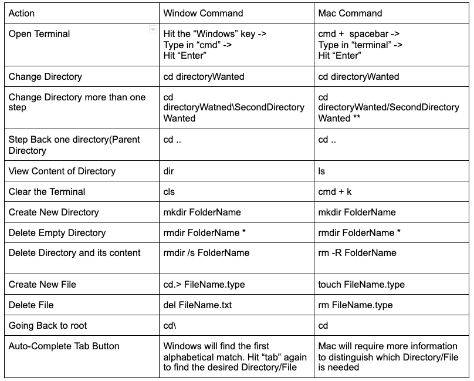

# Understanding Linux

Watch this video to learn the basics of Linux:

<iframe width="560" height="315" src="https://www.youtube.com/embed/cBokz0LTizk?si=c8X1UzUlwAwy38Mz" title="YouTube video player" frameborder="0" allow="accelerometer; autoplay; clipboard-write; encrypted-media; gyroscope; picture-in-picture; web-share" referrerpolicy="strict-origin-when-cross-origin" allowfullscreen></iframe>

## Introduction

Linux is a Operating System. When talking about learning Linux is to learn how to navigate the terminal, install packages, and understand the file system. Linux is the most popular operating system for robotics because it is open source and free.

Here are some of the most common commands:

### Activities

Do the following activities to get familiar with Linux:

1. Open the terminal and list out files in your home directory. Navigate to the path "cd /" and list out the files in the root directory. Navigate back to your home directory.

2. Create a new directory in your home directory called "robotics". Create a new file in the "robotics" directory called "hello.txt". Write "Hello World" in the file.

3. Install a package using the package manager. For example, install "git" using the command `sudo apt install git`.

4. Remove the package you installed in the previous step using the package manager.

5. Search for a file in your home directory using the `find` command.

6. Create a new user using the `adduser` command.

7. Switch to the new user using the `su` command.

8. Change the permission of the file you created in step 2 to only be able to be read, edited, and executed by the owner.

9. Move a file to a new location in your computer

10. Find out the network information including when its connected to wifi and its IP address.
