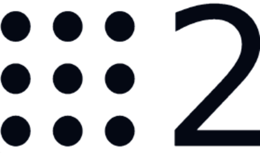

# Quick Start - Building a ROS2 Robot

## Introduction

Welcome to the Quick Start Guide for URDF Creator!

***We advise that all users of URDF Creator, both students and experienced robot developers, to go through this quick start guide before looking at the detailed documentation.***

The URDF Creator is a powerful tool tailored for ROS2 users, facilitating the creation of robot models within the ROS ecosystem. The URDF (Unified Robot Description Format) defines the geometry, kinematics, joint connections, sensor specifications, as well as transformations between frames provided by the robot state publisher.

## Understanding URDF

### What is a URDF?

URDF (Uniform Robot Description Format) serves as a standardized XML-based format for describing robots in ROS. It encompasses various elements such as links, joints, sensors, and visuals, all crucial for accurately representing a robot's physical structure and kinematics.

### Links and Joints

- **Links** represent physical components of the robot, such as wheels, arms, or sensors.
  
  

- **Joints** define the connections between these links, enabling movement and articulation.
  
  

### Modeling Shapes in URDF

URDF models consist of three basic shapes: cubes, cylinders, and spheres. These shapes are used for their simplicity and computational efficiency.

## What is ROS2?

### Overview of ROS2



ROS2 (Robot Operating System 2) is an open-source framework that provides libraries and tools to help software developers create robot applications. It is widely used by researchers, hobbyists, and industrial developers to build and simulate robots.

Learn more about ROS2 [here](https://docs.ros.org/en/jazzy/).

## Building a Basic Bot with the URDF Creator

### The User Interface

Before we start building our robot, let's familiarize ourselves with the URDF Creator's user interface.


Some of the key features of the URDF Creator include:

1. **Menu** (Top Left): Access to the export URDF option as well as future development into project management.
2. **Project Name** (Top Left): Name of the robot, will be used as the name of exported packages. Default: robot
3. **Tools** (Top Middle): Tools for moving, rotating, and resizing links.
4. **Object Tree** (Left): Displays the hierarchy of links in the robot model. Joint information is carried inside each link but the base_link defining its relationship to its parent.
5. **Add Objects** (Bottom Left): Buttons to add shapes to the scene.
6. **View** (Center): Main view which can be viewed from different angles, and links can be selected and manipulated.
7. **Object Parameters** (Top Right): Once a link is selected, information about the selected link. The following parameters can be altered:
    - **Link Name**: Name of the link also used as the frame_id in the URDF.
    - **Color**: Color of the link.
    - **Weight**: Weight of the link.
    - **Joints**: Joints that are connected to the link.
    - **Position**: Position of the link.
    - **Rotation**: Rotation of the link.
    - **Scale**: Scale of the link.
    - **Sensor**: Sensor information of the link. Used by ROS2 for its frame ID but parameters in simulation give accurate representation of the actual sensor.
8. **URDF Code** (Bottom Right): Displays the URDF code generated in real-time as you manipulate the shapes and set their attributes.

### Adding Shapes to the Scene

Each part of a robot that moves independently is represented as a link in URDF. Links are connected by joints, which define how the links can move relative to each other.

1. **Locate the add buttons** in the bottom left corner of the screen.
2. **Click the desired shape** (cube, cylinder, or sphere) to add it to the scene.

In this example, we will add a cube for the base of our robot. Note that the origin of the grid is used by the center of the robot with ROS2. For a Differential Drive robot, the center of the robot is the center of the back wheels on the ground.


### Manipulating Shapes

Manipulate the cube by first selecting it either by selecting it or clicking on it in the Object Tree.


Move the cube accordingly to the shape of the base of the robot off the ground as high as the wheels will be.


To give specific scaling, positioning, or rotation of a link, use the parameters in the Object Parameters section.


### Adding Wheels

Next, we will add the wheels to the robot by inserting a cylinder. First by scaling, then position the cylinder in place.


Also, in the parameters is the ability to change the name of the link. The name of the link will be used by ROS2 as the frame_id. We will change the wheel name to be a unique name.


We can use the duplicate function by right-clicking on the link in the Object Tree and selecting duplicate. This is also a way to delete links.


After positioning the wheels, we should get something like this:


### Adding a Camera Sensor

Next, we will add a camera sensor to the robot. This will be the position of the camera on the robot and will define the transformation between the robot and where its camera is for other nodes to use, such as orb_slam2. Mark this link as a camera sensor in the parameters and name it camera_link. The sensor details will be primarily used by Gazebo for simulation.


### Adding Joints

Finally, we will add the joints which define the relationship between the child and parent link. To define the joint, select the child link and in Object Parameters select the type of joint it is.


After adding the joints, we should have a robot that looks like this:


The robot is now ready to be exported as a URDF file and used in ROS2.

## Exporting the URDF and Robot Description Package

### Exporting Process

1. **Export Menu**: Click the menu button in the top left corner of the screen.


2. **Exporting**: Select "Export URDF" to generate and download your URDF file.


The exported URDF file serves as the blueprint for your robot's virtual representation within ROS, enabling simulation, visualization, and control.

The exported zip folder should be the name of your robot with _description at the end.


Unzip the folder and place it in your ROS2 workspace in the src folder.

For more information on how to use the URDF in ROS2, please visit the ROS2 documentation:

[ROS2 URDF Documentation](https://docs.ros.org/en/jazzy/Tutorials/Beginner-Client-Libraries/Creating-A-Workspace/Creating-A-Workspace.html)

### Package Contents

Looking at the contents of the ROS2 packages, what is included is as follows:


- **launch**: Contains the launch files for the robot.
- **URDF**: Contains the URDF file for the robot.
- **SDF**: Contains the SDF file for the robot. This is used in Gazebo Simulation.

To launch the robot description and see it in RViz, use the following command:

```bash
ros2 launch <name>_description display.launch.py
```

This will launch the robot in RViz, and you should see the robot in the center of the screen.

## Next Steps

### Further Guides

- Explore ROS2 control and other advanced features.
- [ROS2 Control](https://control.ros.org/master/doc/getting_started/getting_started.html)
- Visit the GitHub repository to report issues and contribute to the project.
- Fill out our bug survey to help us improve the tool.

We extend our gratitude to the ROS2 community for their invaluable contributions to robotics and open-source software. Let's embark on the journey of designing and deploying ROS2 robots with the URDF Creator!

To support this effort, please consider helping to add to these tutorials and documentation with examples and best practices for making the developer experience better.
